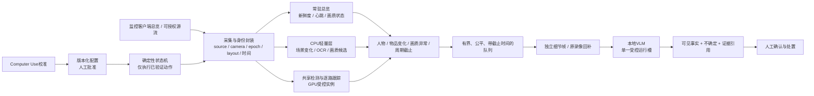

# 主动巡视与本地告警架构与落地路线

**决策：以持续总览为底座、以经过校准的 Computer Use 驱动有限状态机、以事件触发的本地视觉复核补细节；单屏逐路放大仅作保底方案。** RTX 4060 8 GB、约一万元整机是当前预算设计基线，不是已核实报价，也不代表十路/十六路性能已达标。对现场的稳定承诺必须由目标 Windows 客户端、实际码流和长时间运行数据决定。

## 画面预算先决定架构

在不计客户端边框和叠字的理想 1920×1080 单屏上，九宫格每格最多约 640×360；十六宫格每格约 480×270。若客户端预览本来只有 640×360 子码流，放大窗口只能放大这 640×360 源信息，不能恢复已丢失的像素；要取得更细画面，必须验证客户端确实切换到更高分辨率主码流或另开了真正独立的源流。**单路放大不等于高画质，也不等于十路同时可见。**

单屏巡视参数暂按“离开总览 6 秒、回到总览并确认 1 秒”估算。以下为规划算术，不是目标设备实测；它还假定每次切换成功、没有边框/弹窗、巡视结果及时回执。

|轮询路数|理想宫格|单格上限|不停歇逐路名义一轮|180 秒/小时总览盲时预算下的长期平均一轮|
|---:|---:|---:|---:|---:|
|9|3×3|640×360|63 秒|约18分钟|
|16|4×4|480×270|112 秒|约32分钟|

若持续按 6+1 秒逐路巡视，总览每小时约不可见 3,086 秒，远超 180 秒/小时预算。18/32 分钟是长期平均轮询下界，不是最坏情况 SLA；事件和故障还会拉长回访。调度预留含 0.25 秒调用裕量，超过详情截止或实际盲时预算会明确报故障；进程卡死或无人回总览时，软件不能强行保证物理盲时上限，因此独立常驻总览仍是首选。不能把“单屏串行”包装成连续监控。

## 推荐运行结构

优先保持总览采集新鲜，同时从第二窗口、经授权的 RTSP/SDK 或原录像取细节帧；须核对镜头身份、时间戳和源像素增益。双屏（含虚拟显示）须在真实客户端验证采集、遮挡、失焦、最小化行为，不能假定 WGC 遮挡后仍有有效帧。无细节入口时才用受盲时约束的单屏巡视，并显示过期和未覆盖镜头。

采集、总览心跳、录像和告警队列相互隔离，VLM 超时不能阻塞采集。CPU 先做轻量场景差异、OCR、新鲜度；GPU 共享一个检测实例，VLM 用单一串行槽和硬截止时间，按新鲜度、公平轮转限制积压，不重复加载模型。显存不足则降级为按需复核或更强设备，不能静默漏报。VLM 只报告可见事实与不确定性，并保留录像时间戳供人工复核。

四类触发互补：

- **人物触发：**检测到经过任务标定的人员/轨迹与区域关系时形成候选；小格、模糊、遮挡下“没有检测到人”只能是未知，不能推断员工离岗。
- **物品变化：**无人物时仍可用固定参考检测持续视觉变化。像素变化层负责召回候选，不给物品命名，也不判断偷窃或动机；首帧不能证明缺失，参考更新须受控，避免把物品离开后的画面自动学成正常。
- **画质/链路异常：**冻结、黑屏、遮挡、严重模糊、过曝或时间戳停滞转成“无法观察”故障，不当作无事件；心跳必须独立于人物检测和 VLM。
- **周期巡视：**即使没有变化候选，也按每路截止时间轮转，热点不能饿死安静镜头。过期请求、相机身份不符、回总览失败都计入覆盖失败。

## Computer Use 的学习边界与必要数据契约

Computer Use 负责识别界面、提出按钮/瓦片定位和动作序列，并辅助布局变化后的重标定。操作者确认后保存版本化校准配置：客户端/窗口身份、尺寸/DPI、镜头顺序、UIA 属性或坐标锚点、视图指纹及网格/细节 ROI 变换。发布前验证 detail→grid 闭环；运行时只执行批准动作，不让模型探索按钮或盲点。

运行状态机每步等待新鲜回执并核对 request ID、目标镜头、视图模式、布局指纹和帧时间。弹窗、焦点丢失、配置过期、错镜头、过期帧或返回失败立即冻结点击并标成未知/故障，提示人工恢复。若运行时持续每次动作都请求在线大模型，定位误差、推理时间和模型状态会进入控制闭环；一次校准后执行确定性状态机，更容易复现、审计和回滚。【这一稳定性判断是架构推断，不代表目标客户端已经验证。】

把新模块接入采集与消费链路前，必须补齐这些前置契约：

1. 帧进入队列时固化 `source_id`、`camera_id`、采集单调时间、`view_epoch`、模式、布局指纹、ROI/坐标变换和原始帧标识。消费者不得在出队时根据可变全局 `view_state` 重新解释旧帧；视图切换交叠帧标 unknown。
2. 网格与细节分别维护 ROI 和质量门槛；切换镜头/视图时按镜头重置跟踪、规则基线与复核序列，绝不跨镜头延续人员 ID。监控进程另有独立 per-camera freshness heartbeat；VLM 活着不能代替视频新鲜度。
3. 物料/工位任务按目标分开标定：大物料移动、小物件变化、手部动作、工位占用要求不同的源像素、帧率、视场覆盖和留出集。通过哪种任务，就只宣称支持哪种任务；不从场景差异模块推导细粒度分类能力。

## 当前交付边界与研发路线

本轮四个新增模块仍是**隔离实验**，未接入 runtime，也未改写已交付 Windows 包：[`SceneChangeWatch`](../src/factory_monitor/scene_watch.py) 算固定 ROI 像素变化；[`InspectionPlanner`](../src/factory_monitor/active_inspection.py) 给出巡视建议但不操作 OS；[`inspection_profile`](../src/factory_monitor/inspection_profile.py) 核验回放记录/配置指纹，不检查真实 UI；[`view_feasibility`](../src/factory_monitor/view_feasibility.py) 仅计算理想像素与盲时，不证明画质或现场可行。合成实验不证明十/十六路稳定、Seetong 兼容或现场通过。当前应用配置仍最多 10 路；16 路仅属于新调度模块的实验能力。运行方法见 [实验包说明](ACTIVE_OBSERVATION_LAB_zh.md)。

PD（Prefill/Decode 分离）先不纳入约一万元、RTX 4060 单卡基线。被审查的异构仓库是实验报告与绘图材料，没有可复用的推理服务、安装启动脚本或完整部署实现；作者所报拓扑为多张 RTX 6000D 加 DGX Spark，且并非当前 Qwen 图像候选负载。拆分阶段不能解决源画面过小或语义误判；额外进程、KV 搬运和故障面反而增加验收成本。只有证明单卡瓶颈确在视觉 Prefill/Decode、并已有第二个受支持计算设备后，才做等输入、等版本、有故障注入的 PD 对照。[异构方案审查与官方一手资料](HETEROGENEOUS_STABILITY_20260925_zh.md)

|阶段|可交付证据|放行边界|
|---|---|---|
|无新增依赖流水线实验|四模块输入/输出、盲时预算、错绑/过期/恢复失败报告|只证明模块逻辑，不驱动客户端|
|Windows 客户端标定|UIA/坐标配置、双窗口/码流真实性、失焦/遮挡/最小化与切换故障注入 100 次|身份、清晰度、回总览或配置校验不通过即冻结自动动作|
|任务能力验证|独立正负样本，分别报召回、误报、未知与人工复核|物料、动作、占用、画质分别设门槛，不互相代替|
|功能演示|真实客户端连续运行 15–30 分钟，包含真实无人时段、候选、回放与人工确认|需有来源、时间戳和原始证据；合成回放只能标作合成|
|长期验收|目标配置完整班次/72 小时运行及复核|十路或十六路、持续性和告警时限逐项给证据后才对外承诺|

对外能力表述限定为“对已标定来源中的可见变化生成提示，展示依据与不确定性，由人判断”。不分类人格、不推测意图、不把偷窃或员工品德作为模型结论，不自动作出处分。任何尚未通过对应任务和现场来源验收的镜头、角度、动作或运行时长都应明确显示未知/未覆盖。

相关原始方案：[中国大陆十路架构设计](superpowers/specs/2026-09-25-mainland-ten-camera-design.md)、[单屏主动观察研究](ACTIVE_VIEW_RESEARCH_20260925_zh.md)、[无人像与九/十六宫格设计](superpowers/specs/2026-09-25-active-observation-design.md)、[异构 GPU 稳定性评估](HETEROGENEOUS_STABILITY_20260925_zh.md)。
