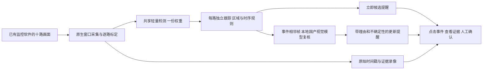

# 中国大陆十路监控：架构、执行包与验收

2026-09-25 更新。用户已确认真实监控画面在另一台 Windows，当前无法远程接入，先交付 Windows 执行包。当前是供集成与实测的工程候选；未通过十路现场交付。

## 已执行与发现

已完整读取“监控执行落地”两页、20 个 turn 的用户消息和最终答复，并核对现有源码/状态。最新 Windows 停止与录像修复尚未回传，所以升级工具复制现场最新源码后应用有上下文校验的补丁，不能用旧 main 覆盖现场。

当前 Apple M5/32GB 的真实组件结果：

| 验证 | 结果 | 不能说明什么 |
|---|---|---|
| 同模型同环境十图检测 A/B，10 轮 | 模型实例 10→1；十图 p50 166.68→52.71ms，p95 215.54→53.42ms；每轮各路人数一致、总人数32 | 是一张公开照片生成十张不同裁剪图，不是十路视频、目标Windows或准确率评估 |
| 进程内存，10ms采样 | 656.50→544.48MiB RSS | 不是总GPU/统一内存峰值 |
| Qwen单图原接口 | 冗长重复回答导致256token截断、无效JSON | 服务器可访问不等于应用可用 |
| 有界JSON schema修复后单图 | 约1.38秒返回合法结果；但误报照片中的人持线缆 | 格式正确不代表语义正确 |
| Qwen十件同时复核，每件两帧，各图字节不同，含排队15秒 | 2件合法完成、8件超时；完成2件均误报公开公交负例 | 当前模型不满足十件同时完成门槛，也不能用于自动认定偷窃 |

Qwen负例与超时原始结果保留在本地报告。不要通过放宽期限、只统计完成请求、重复相同图片缓存、延长输出上限或改“通过”口径来掩盖失败。结构化输出只修复接口；下一步必须依据现场标注样本改检测/物料规则与模型选择。

## 选定架构

Windows 使用 WGC；Mac 使用 ScreenCaptureKit。无需换摄像头。Computer Use 只执行已标定的窗口切换与恢复；稳定采集/推理不能依赖大模型不停点桌面。当前自动控制保持关闭，先完成实际客户端校准。未来有合法可用码流时，可增加 RTSP/ONVIF 接入，提高细节与窗口独立性；它不是当前屏幕入口的先决条件。

检测模型共享一次批量前向，每路独立 ByteTrack。盲区、画面失效、网格/详情切换会重置对应跟踪状态。新的自动设备配置优先 CUDA，其次 MPS，再到 CPU。只提交可观测路；没有画面不能解释为“没人”。WGC时间取回调时刻，排队不能把旧帧变成新帧；仍不代表远端摄像头传感器采集时间，客户端网络延迟另测。

事件候选先进入屏幕提醒，Qwen结果再更新；点击界面“查看最新提醒”定位该事件，选中详情随模型/录像结果更新。机器结果与人工标签分开。模型不能自行输出“已确认偷窃/偷懒”；规则只能描述物料经过、区域停留、排班内工位连续无人等可观察事件。

屏幕十宫格是信息瓶颈：1080p屏幕分4×3时每格约480×360，手部小物件可能已不可辨；后端换更大模型无法恢复不存在的像素。现场必须标定最小可辨物料尺寸和遮挡，模糊/遮挡列为不可判定。原有2fps证据不足以证明快速手部动作识别，需要真实样本决定原始录像帧率与局部放大/直接流路线。

## 国产模型与上游技术

本轮本地 Qwen3-VL-2B-Instruct 不需要云API Key；项目固定127.0.0.1:11435，禁云。执行包预置权重/依赖/Windows运行时，运行AI不依赖GitHub或Codex。Seetong取得画面的网络与AI本机推理是两条独立链路；大陆现场线路尚未测。

VLX-Seek当前公开10B路线、Linux侧主要测试及额外检测依赖，不直接移植到8GB卡作为本次基线。Laya是文本决策工具，不处理图像，不加入视觉链路。细节和来源见[研究核查](MAINLAND_RESEARCH_20260925_zh.md)。

商业化下一步：保留可替换检测接口，优先收集本站物料/动作标注，评估国产专用轻量检测，再把Qwen当事件解释助手；不要让通用2B模型充当物料探测器。现有Ultralytics依赖标AGPL-3.0，闭源商业分发需另选兼容许可路线或正式商用许可；研究包不能被当作许可已经清理的商业发行。

## 一万元硬件约束

已有4060 8GB先测，不因本次Mac检测优化直接买新硬件。若新购，优先验证16GB显存方案；5060Ti 16GB公开报价大约3600–5100元，购买时以明确16GB SKU和售后报价核实。[报价及官方规格来源](MAINLAND_RESEARCH_20260925_zh.md)

预算设计上限（不是商家报价，也不是已通过配置）：显卡5000，CPU+主板2000，32GB内存800，1TB NVMe500，电源/机箱/散热1000，装配/系统/售后余量700，合计10000元。任一真实报价超额就重算，不能把8GB显卡或16GB系统内存的低价整机标题当作满足本方案。4060与16GB卡均须测检测+VLM+录像的同时峰值和时效。

Windows包固定Python3.12 x64、CUDA 12.8版PyTorch2.11.0、torchvision0.26.0、Ultralytics8.4.155及哈希锁。实际驱动/GPU算子须在目标机器通过CUDA探针；不把CPU回退冒充RTX性能。Mac A/B使用Torch2.14.0，版本差异必须通过Windows实测消除。

## 执行顺序

1. 从最新Windows修复源码创建独立候选；补丁上下文不匹配立即停止，保留原机版本。安装完全使用随包资源、哈希锁，不升级原环境。
2. 启动本机模型，运行依赖/GPU/模型诊断和公开图片组件容量测试。负例误报、超时分别记FAIL，输出合法不可代替正确。
3. 在Seetong标定十个不同真实镜头：一路核通、三路快速检查后同轮十路。确认每路更新、实际检测设备、匿名轨迹不串路；不修改固定5分钟无人规则来缩短正式演示。
4. 保留现场修复版的录像保护和停止协议，回归重叠5+5、容量第11件、停止排空；功能测试与这些直接风险验证并行推进。
5. 按可观察事件定义每类50正/100负保留集，标记漏报、误报、遮挡、物料不清与规则错误。先采集再冻结验证集，禁止边看答案边调同一组门槛后宣布准确率。
6. 15–30分钟真实功能录屏包含真实十路、模型工作状态、候选/复核提醒、点击证据、人工确认和连续5分钟无人过程。此后做完整班次及72小时无人值守稳定性验收。

当前尚无Windows执行、真实十路、4060时效、大陆线路或新实景视频证据，这些项均未验收。当前Qwen准确性与十件突发时效已经有失败证据，必须修正后复测，不能承诺此配置已完成全部目标。

## 商业产品应交付什么

产品价值是把管理者看十路视频的负担缩成可定位、可回放、可纠错的事件清单。第一版卖“物料异常/工位无人等辅助复核”，现场规则、证据质量、漏报记录和人工确认构成服务；不卖自动断言员工有罪。成本核算包括硬件、布点标定、专用物料标注/模型适配、许可证和维护，不能只用显卡价格推导利润。
